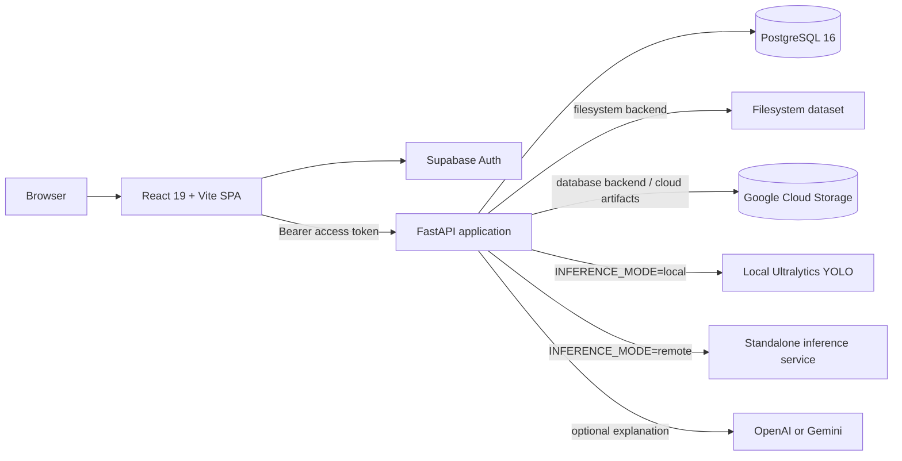
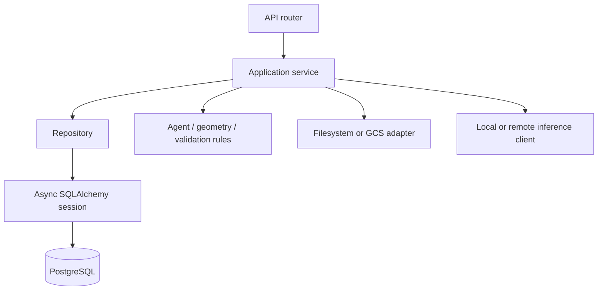
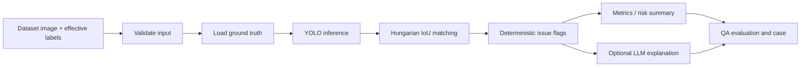
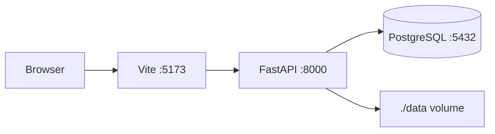

# Label Guardian Architecture

> Updated: 2026-09-05
> Scope: architecture implemented by the current source tree.

This document describes the running system, not the older CVAT-first prototype or
future infrastructure proposals. The source code, Alembic migrations and
OpenAPI output remain the authoritative behavior definitions.

## System Overview

Label Guardian is a 2D perception-annotation QA platform. It ingests or reads a
versioned image dataset, compares current labels with detector predictions,
creates explainable QA findings, and gives authenticated users a browser-based
workflow to inspect and edit annotations.

The product is split into these runtime boundaries:

| Boundary | Responsibility | Runtime |
|---|---|---|
| Web application | Navigation, dataset browser, QA queue, reports, editor and admin views | React 19, TypeScript, Vite |
| Application API | Authentication, dataset access, evaluation, QA cases, revisions and control plane | FastAPI modular monolith |
| Relational store | Users, datasets, objects, evaluations, cases, revisions and audit events | PostgreSQL 16 |
| Object store | Production image and annotation artifacts | Google Cloud Storage |
| Detector | YOLO inference, either in-process or behind an HTTP service | Ultralytics/Torch |
| Identity provider | Login, refresh sessions and user identity | Supabase Auth |
| Optional explanation layer | Natural-language explanation of already-determined findings | OpenAI or Gemini through LangChain |

## Runtime Architecture



The application API is the security and orchestration boundary. The browser
does not receive database credentials, GCS service credentials, inference
service tokens or LLM API keys.

## Frontend

The frontend lives under `frontend/` and is a Vite single-page application.
`frontend/src/App.tsx` composes the shell and routes. The main areas are:

- Overview, pipeline, dataset run and reports views.
- QA queue and case detail views for findings and evidence.
- Annotator workspace with frame viewer, object list, properties and revision
  actions.
- Admin control plane for application configuration and user administration.
- Settings and tutorial views.

Important frontend boundaries:

| Area | Implementation |
|---|---|
| API data | `frontend/src/api/`, TanStack Query and typed DTOs |
| Auth | `@supabase/supabase-js` through `frontend/src/auth/` |
| Domain rules | `frontend/src/domain/` |
| Mock/demo mode | `frontend/src/data/mock/` and `frontend/src/state/` |
| Real-data views | `frontend/src/views/`, `frontend/src/features/qa-queue/` |
| Annotation display/editing | `FrameViewer`, `AnnotationEditPanel` and related components |

The frontend can run with mock data for UI development. Real-data mode calls the
versioned API and attaches the Supabase bearer token to protected requests.

## Application API

`src/main.py` creates the FastAPI application and its lifespan-managed database,
authentication and dataset services. `src/api/routes.py` assembles the routers.
The canonical public prefix is `/api/v1`; `/api` is retained as a compatibility
alias and omitted from the generated OpenAPI schema.

Current route groups include:

| Router | Responsibility |
|---|---|
| `auth` | Current user, application users and role administration |
| `control_plane` | Operational configuration and administration endpoints |
| `ingestion` | Dataset ingestion and cloud-ingestion operations |
| `qa_cases` | QA case queue, case detail, status and audit operations |
| `real_dataset` | Dataset catalog, image access, annotation revisions and evaluation |

System endpoints include `/health`, `/api/v1/health` and `/ready`. Readiness
checks PostgreSQL connectivity.

The internal backend layering is:



## Dataset and Annotation Model

The configured dataset backend is either:

- `filesystem` for local development, where the API resolves paths below
  `DATASET_ROOT`; or
- `database` for production, where dataset metadata and object provenance are
  stored in PostgreSQL and image artifacts are held in GCS.

The core data flow is:

```text
Dataset source
  -> ingestion/catalog
  -> qa_images + qa_objects + provenance
  -> detector evaluation
  -> qa_evaluations + qa_cases
  -> annotation_revisions
  -> re-evaluation and audit history
```

Annotation ownership is revision-based:

- The imported source is revision 0.
- Save and restore create new immutable revisions.
- The API reads the latest effective revision for the dataset image.
- Clients send `expectedRevision`; stale writes are rejected with a conflict.
- Audit records retain actor, note, previous/current revision and case changes.

Relevant persistence models include `qa_images`, `qa_objects`,
`qa_object_provenance`, `qa_evaluations`, `qa_cases`, `annotation_revisions`,
`audit_logs`, `application_users`, ingestion job tables and CVAT dataset image
mappings.

## QA and Inference Pipeline

The detector and QA rules are separate from natural-language explanation.
`src/agents/graph.py` and `src/agents/nodes/` implement the pipeline stages:



Deterministic rules identify issues such as wrong class, loose or misaligned
boxes, duplicate labels, missing labels and extra predictions. Matching uses
IoU and one-to-one assignment. The LLM can explain structured findings, but it
does not decide issue type, change the source labels, approve a case or replace
the deterministic rules.

The application supports two detector modes:

- `INFERENCE_MODE=local`: the API loads the configured Ultralytics model,
  normally `yolo26n.pt` for CPU-safe operation.
- `INFERENCE_MODE=remote`: the API calls `src/inference_app.py` through
  `RemoteInferenceClient`. The standalone service normally uses `yolo26x.pt`,
  enforces an optional token, validates object URI prefixes and supports single
  and batch detection.

The offline evaluator `scripts/evaluate_golden_yolo.py` runs the detector and
QA rules without the API, database, LLM or CVAT. It uses the repository
checkpoint `yolo26x.pt` and writes reproducible predictions, metrics and a
report under the selected output directory.

## Authentication and Authorization

```text
Browser -> Supabase Auth -> access token -> FastAPI JWT verification
                                      -> application_users role lookup
                                      -> endpoint authorization
```

Supabase owns passwords and sessions. PostgreSQL stores the application user
profile, role and disabled state. In production, authentication is mandatory;
the API verifies issuer, audience, signature and expiry using configured JWKS
or a legacy server-side secret. Role checks protect reviewer, annotator and
administrator operations. Development can run with auth disabled or a local
development identity according to settings.

## Deployment

### Local development



`docker-compose.yml` runs PostgreSQL, an isolated PostgreSQL test service and
the backend. The frontend is normally started separately with `npm run dev`.
Alembic migrations run before the backend starts when `RUN_MIGRATIONS=true`.

### Production deployment shape

The repository contains deployment configurations for a split deployment:

- React/Vite static assets on Vercel or behind a static web server.
- FastAPI on Railway or a container platform.
- PostgreSQL and Supabase Auth for application state and identity.
- GCS for private dataset artifacts.
- A dedicated GPU inference service when remote inference is enabled.

Cloud ingestion can run as a separate worker/service using the ingestion
modules and GCS storage adapter. The current repository does not require Redis,
Celery or a vector database for the main request path.

## Repository Structure

```text
src/
  api/             FastAPI routers and dependencies
  agents/          QA graph, geometry, matching, flagging and explanations
  db/              Async SQLAlchemy engine/session/base
  models/          ORM models and Pydantic schemas
  repositories/    Database access
  services/        Auth, dataset, evaluation, storage, LLM and inference
  inference_app.py Standalone inference-service entrypoint
frontend/
  src/             React application, routes, views, editor and API client
migrations/        Alembic schema history
scripts/           Ingestion, evaluation, deployment and validation tools
eval/              Golden datasets and evaluation outputs
deploy/            Environment templates and deployment support
```

## Current Limitations

- The local filesystem backend remains useful for development; production
  requires database-backed dataset configuration and cloud object settings.
- Local inference is memory/CPU dependent; large checkpoints belong on the
  dedicated inference service.
- LLM explanation is optional and provider credentials are not required for
  deterministic evaluation.
- The current architecture has no required vector store, queue broker or
  distributed worker for the synchronous API path.
- Operational concerns such as autoscaling, centralized observability,
  disaster recovery drills and managed secret rotation remain deployment
  responsibilities.

## Related Documentation

- [README.md](README.md): local setup and common commands.
- [docs/PROJECT_STATUS.md](docs/PROJECT_STATUS.md): implementation status.
- [docs/TESTING.md](docs/TESTING.md): backend, frontend and migration tests.
- [docs/INFERENCE_SERVICE.md](docs/INFERENCE_SERVICE.md): standalone detector.
- [docs/SUPABASE_DEVELOPMENT.md](docs/SUPABASE_DEVELOPMENT.md): auth and database development.
- [docs/CLOUD_DEPLOYMENT.md](docs/CLOUD_DEPLOYMENT.md): cloud deployment paths.